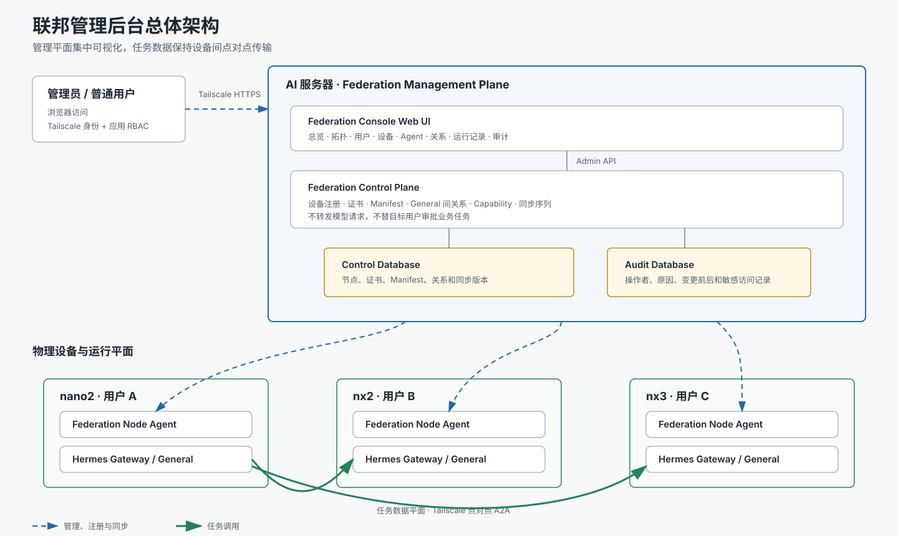
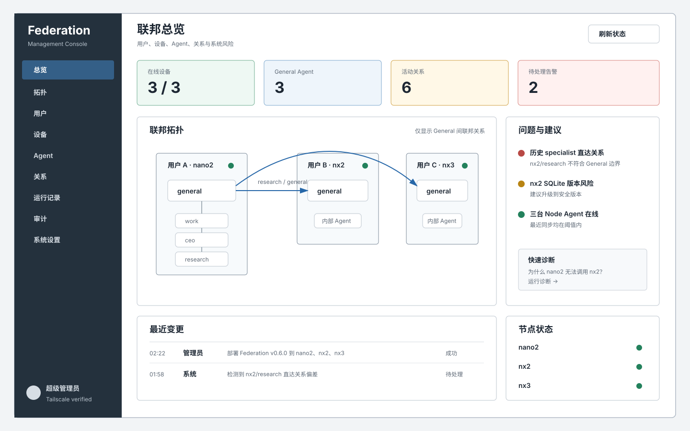

# 一、联邦管理后台（Federation Console）

## 1. 文档信息

- 状态：第一版已实现并部署，节点任务正文读取协议待后续接入
- 日期：2026-08-08
- 部署位置：AI 服务器
- 所属系统：Hermes A2A Federation
- 实现边界：独立联邦组件，不修改 Hermes Agent 核心

## 2. 背景

当前联邦架构已经包含用户、物理设备、Gateway、Agent、能力、关系、
审批、控制平面和点对点任务调用。随着设备与用户增加，仅依靠命令行和
SQLite 数据排查关系，会越来越难以回答以下问题：

- 当前有哪些用户、设备和 Agent？
- 哪个 Agent 属于哪个用户并运行在哪台设备？
- 哪些 Agent 之间允许调用，允许调用什么能力？
- 一次调用为什么成功、等待审批或失败？
- 修改或撤销一条关系会影响哪些会话和备援路径？
- 哪些设备存在离线、版本不一致、配置漂移或时钟异常？

因此需要在 AI 服务器上建设统一的 Federation Console，将 AI 明确为
联邦管理平面。

## 3. 产品目标

Federation Console 应当：

1. 清晰展示“用户 -> 设备 -> Agent -> 关系”的完整拓扑。
2. 提供设备、Agent、能力和 A2A 关系的统一管理。
3. 将复杂调用失败转化为逐层、可解释的诊断结果。
4. 在执行关系变更前展示影响范围，降低误操作风险。
5. 提供完整的权限控制、敏感访问保护和不可抵赖审计。
6. 支持未来多用户、多设备和单设备多租户扩展。

Federation Console 不应：

- 成为 Agent 正常任务的数据转发节点。
- 取代每台设备自己的 Hermes Gateway。
- 代替目标用户批准跨 Agent 业务请求。
- 默认集中保存所有任务正文、模型回复或用户私人记忆。
- 向浏览器返回私钥、令牌、模型凭据或其他秘密。

## 4. 总体架构



AI 后台不转发模型请求和模型回复。后台或 AI 控制服务暂时不可用时，节点应
继续使用有效的本地关系缓存运行。

## 5. 信息架构与主界面

一级导航固定为：

```text
总览 | 拓扑 | 用户 | 设备 | Agent | 关系 | 运行记录 | 审计 | 系统设置
```

总览页面线框：



## 6. 核心功能

### 6.1 联邦拓扑

拓扑图按照三层展示：

```text
用户 -> 设备 -> Agent
```

调用关系使用有方向的边表示。每条边至少展示：

- 调用方和目标方。
- Scope 和 Capability。
- 启用、撤销、未同步或异常状态。
- 是否要求目标用户审批。
- 最近一次成功和失败时间。
- 当前关系版本和节点同步状态。

拓扑应支持按用户、设备、Agent、能力、在线状态和异常状态过滤。

### 6.2 用户管理

用户页面展示：

- 用户标识和显示名称。
- 用户拥有的设备。
- 用户拥有的私有、公开和 Guest Agent。
- 用户可以发起和接收的联邦关系。
- 用户当前可见和可管理的资源范围。

普通用户只能查看和管理自己拥有的资源。超级管理员可以查看完整联邦。

### 6.3 设备管理

设备页面至少展示：

- Node ID、设备名称、Owner、Transport ID。
- 在线状态、最后心跳和系统时钟偏差。
- Hermes Runtime 和 Federation Plugin 版本。
- Gateway、Node Agent 和 Agent Card 健康状态。
- Manifest generation、生成时间、过期时间和摘要。
- 公开 Agent、监听地址和能力。
- 配置摘要、配置漂移和数据库健康状态。

后台应突出显示版本不一致、心跳过期、Manifest 临期、时钟偏差、配置未同步
和服务异常。

### 6.4 Agent 能力目录

每个 Agent 应展示：

- 所属用户和设备。
- Agent ID、Slug、显示名称和描述。
- 能力集合和路由优先级。
- Hermes Profile 或 Federation Guest Profile。
- 模型与 Provider 的非敏感摘要。
- 当前可用性和最近调用状态。

Agent 类型必须明确区分：

- 私有 Agent。
- 本地可调度 Agent。
- 联邦公开 Agent。
- Guest 隔离 Agent。
- 已暂停或不可用 Agent。

### 6.5 A2A 关系管理

后台允许执行受控写操作：

- 创建设备注册 Enrollment。
- 创建 A -> B 的有向关系。
- 设置 Scope 和 Capability。
- 启用或撤销关系。
- 查看节点是否已经同步关系。

关系变更必须经过：

```text
编辑 -> 合法性校验 -> 影响预演 -> 二次确认 -> 执行 -> 同步跟踪 -> 审计
```

后台不得使用无方向的“互相信任”表达。A -> B 和 B -> A 是两条独立关系。

### 6.6 调用诊断器

用户输入：

```text
调用方：nano2/default
目标方：nx2/research
能力：research
```

后台按实际调用顺序输出检查结果：

```text
✓ 调用方设备在线
✓ 目标设备在线
✓ 调用方 Agent 已注册
✓ 目标 Agent 已注册
✓ Control Plane 关系存在
✓ Source ACL 正确
✓ Target ACL 正确
✓ Capability 匹配
✓ Manifest 和证书有效
✓ 签名任务断言可生成
! 当前 Context 尚未获得目标用户批准
```

每个失败项必须给出：

- 人类可读原因。
- 对应设备、Agent 或关系。
- 建议处理方法。
- 是否可以在后台安全修复。
- 修复可能产生的影响。

### 6.7 变更影响预演

创建、修改或撤销关系前必须展示：

- 将失去或新增访问能力的 Agent。
- 受影响的未完成操作和会话数量。
- 是否仍有本地或远程备援候选。
- 是否会造成某种 Capability 完全不可达。
- 哪些节点需要重新同步。

示例：

```text
准备撤销：nano2/default -> nx2/research

影响：
- nano2 主 Agent 将失去远程 research 备援
- 2 个未完成上下文可能无法继续
- local:research 仍然可用
- nx2 和 nano2 需要同步新的关系版本
```

### 6.8 运行记录

运行记录默认展示安全元数据：

- 调用方用户、设备和 Agent。
- 目标用户、设备和 Agent。
- Capability 和 Context 标识。
- 创建、审批、开始、结束时间。
- 状态、耗时、重试次数和失败类别。
- 是否发生恢复、幂等命中、故障切换或租约过期。

默认列表不展示任务正文、模型回复、密钥或私人记忆。

## 7. 完整任务内容访问

超级管理员可以查看完整任务正文和模型回复，但采用按需读取模式：

1. AI 后台平时只保存调用元数据。
2. 管理员点击查看正文时必须进行二次验证。
3. 管理员必须填写查看原因。
4. Admin API 向源节点或目标节点发起一次受认证的临时读取。
5. 节点只返回该管理员被授权查看的指定操作。
6. 内容只在当前页面短时显示，默认不写入 AI 数据库。
7. 内容不得写入普通应用日志、浏览器持久缓存或分析系统。
8. 每次读取都生成不可删除的审计事件。

正文查看权限不能用于读取：

- 节点私钥和 Token。
- 模型 Provider 凭据。
- 与指定操作无关的 Profile 文件。
- 用户完整记忆库。
- 其他用户未关联的会话。

## 8. 权限模型

第一版采用分级多用户权限。

### 8.1 超级管理员

可以：

- 查看全局拓扑。
- 管理用户、设备、Agent 和关系。
- 创建 Enrollment。
- 执行关系变更和影响预演。
- 在二次验证后按需查看完整任务内容。
- 查看全局审计和系统设置。

### 8.2 普通用户

可以：

- 查看自己拥有的设备和 Agent。
- 查看与自己相关的关系。
- 查看自己任务的运行状态和内容。
- 提交关系创建或撤销申请。

不能：

- 查看其他用户的私有设备、Agent、任务正文和记忆。
- 修改不属于自己的关系。
- 替其他用户批准跨 Agent 业务请求。

未来可以增加只读审计员和运维人员角色，但第一版不要求。

## 9. 审计

以下操作必须写入不可删除的审计记录：

- 登录和失败登录。
- 设备注册和 Enrollment 创建。
- 关系创建、修改、启用和撤销。
- 权限和角色修改。
- 配置或版本管理操作。
- 任务正文查看。
- 诊断器建议的一键修复。

每条审计至少包含：

- 操作者和角色。
- 操作时间和来源。
- 操作原因。
- 操作对象。
- 变更前和变更后。
- 操作结果及错误类别。
- 关联的审批或二次验证记录。

## 10. 安全要求

- 后台仅通过 Tailscale HTTPS 提供访问，不开放公网。
- Tailscale 身份用于网络准入，应用层仍执行用户、角色和资源授权。
- 高风险写操作和正文查看必须二次验证。
- 浏览器不能直接访问 Control Plane SQLite。
- Web UI 只能调用受认证的 Admin API。
- Admin API 不能返回私钥、Token、模型凭据或完整环境变量。
- 所有写操作必须具有 CSRF、防重放和幂等保护。
- 后台不能绕过目标用户的微信或 Matrix 业务审批。
- 后台故障不能阻断使用有效缓存的节点间调用。

## 11. 管理接口方向

现有 Node Sync API 保持不变。新增的 Admin API 应与节点同步接口隔离，
使用独立认证和授权策略。

第一版至少需要以下资源接口：

```text
/admin/overview
/admin/users
/admin/nodes
/admin/agents
/admin/relationships
/admin/diagnostics
/admin/operations
/admin/audit
```

关系写接口必须支持：

- 请求幂等键。
- 影响预演。
- 二次确认 Token。
- 操作原因。
- 变更结果和同步状态。

任务正文读取使用独立的敏感接口，不能混入普通运行记录响应。

## 12. 部署原则

建议部署结构：

```text
AI 服务器
├─ Federation Control Plane
├─ Federation Admin API
├─ Federation Console Web UI
├─ Control Database
└─ Audit Database
```

实现应继续位于独立的 `hermes-a2a-federation` 系统或独立管理组件中，
不向 Hermes Agent 核心增加管理页面或核心 Model Tool。

## 13. 验收标准

1. 超级管理员可以查看完整联邦拓扑。
2. 普通用户不能看到其他用户的私有资源。
3. 后台能准确解释 nano2 无法调用 nx2/research 的具体阻断层级。
4. 创建或撤销关系前能展示受影响 Agent、会话和备援能力。
5. 关系确认后，各节点能在规定同步周期内获得新关系。
6. AI 后台停止后，已有有效缓存的调用仍然可以继续。
7. 未通过二次验证不能查看任务正文。
8. 每次正文查看都产生不可删除的审计记录。
9. 后台不能替目标用户批准跨 Agent 业务请求。
10. 页面和 API 不泄露密钥、Token 或模型凭据。
11. 设备版本、心跳、时钟、Manifest 和配置漂移异常能够被发现。
12. 所有高风险写操作都可以追溯到操作者、原因和变更内容。

## 14. 当前假设

- 第一版复用 AI 上现有 Federation Control Plane 和 ControlStore。
- 当前节点为 nano2、nx2、nx3，设计不写死设备数量。
- 当前主要管理员是系统所有者，后续支持多个普通用户登录。
- 第一版采用受控写操作，不提供任意远程 Shell 或全功能设备运维。
- 超级管理员可以查看完整任务内容，但只采用按需节点读取。
- 任务正文查看必须二次验证、填写原因并留存不可删除审计。
- 目标用户审批继续在目标用户的微信或授权 Matrix 房间完成。

## 15. 第一版实现状态

第一版已在独立仓库 `hermes-a2a-federation` 中实现并部署，未向
Hermes Agent 核心增加管理页面或 Model Tool。

- 发布版本：`v0.7.1`
- 发布提交：`0b604fb`
- 部署设备：AI
- Tailscale HTTPS 入口：
  `https://ai-x10drg.taild500c8.ts.net/console/`
- 已实现：管理员登录、角色隔离、会话与 CSRF、登录限速、总览、
  拓扑、用户、节点、Agent、关系、注册、诊断、审计和系统设置。
- 已实现：关系创建预演、影响说明、密码二次验证、操作原因、
  关系启用与撤销。
- 已实现：管理员数据库和控制数据库隔离、敏感 Cookie、安全响应头、
  数据库文件权限及回退容器。
- 已验证：3 个节点在线、4 个 Agent、7 条关系、0 个告警；
  nano2、nx2、nx3 的 Gateway 和 Node Agent 服务均保持运行。
- 已验证：AI 本机真实 HTTPS 登录，以及 ivan、AMD 两台管理白名单
  设备的 Tailscale HTTPS 远端访问。

第一版明确暂缓：

- 节点尚未发布任务正文和操作元数据，因此“运行记录”页面只展示
  协议未接入状态，不生成或猜测任务数据。
- 后续实现任务正文读取时，必须采用签名的按需节点读取协议，并保留
  二次验证、访问原因和不可删除审计要求。
