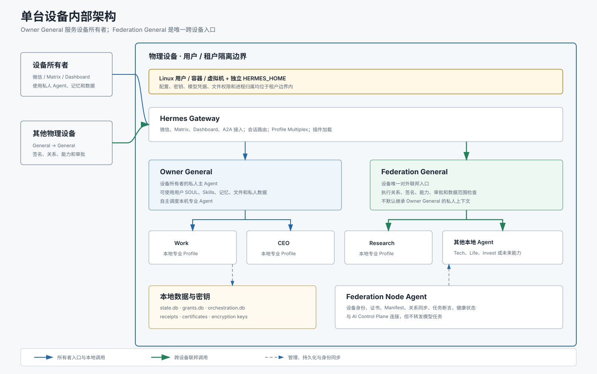
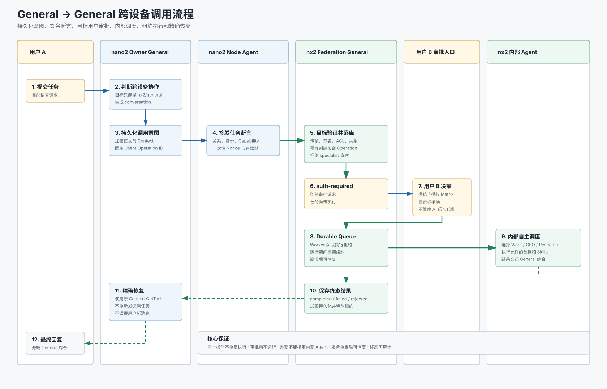
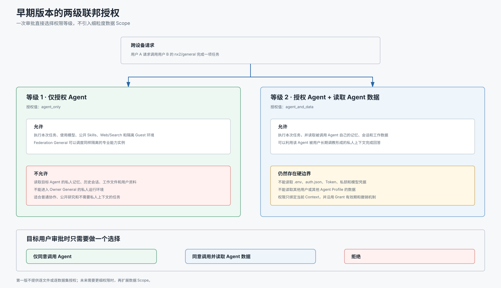

# 三、设备内部与跨设备调用

## 1. 文档信息

- 状态：第三章核心授权边界已确认
- 日期：2026-08-08
- 主题：单台设备内部结构与 General 到 General 的跨设备调用
- 前置约束：跨物理设备只能调用目标设备的 General Agent

## 2. 本章目标

本章定义：

1. 一台物理设备内部需要运行哪些组件。
2. Owner General、Federation General 和本地专业 Agent 的职责边界。
3. 一次跨设备任务从创建、审批、执行到恢复的完整过程。
4. Federation General 的两级授权模型和数据访问边界。
5. 当前部署与目标架构之间仍需迁移的部分。

## 3. 单台设备内部架构



每台物理设备应当是一个完整、自治的 Agent 节点，包含：

- 用户或租户隔离层。
- Hermes Gateway。
- Owner General。
- Federation General。
- 本地专业 Agent。
- Federation Node Agent。
- 本地数据、密钥和运行监控。

### 3.1 用户或租户隔离层

当前阶段采用一台设备服务一名用户：

- 独立 Linux 用户。
- 独立 `HERMES_HOME`。
- 独立配置、密钥、凭据和数据目录。
- 独立 Gateway 与 Node Agent 进程。

后续单设备四租户扩展时，每个租户必须拥有独立 Unix 账户、容器或虚拟机
边界，不能只依靠不同 Hermes Profile 实现用户级隔离。

### 3.2 Hermes Gateway

Gateway 负责：

- 微信、Matrix、Dashboard 和 A2A 接入。
- 消息会话和平台身份。
- Profile Multiplex。
- 插件加载和工具调用。
- Owner General 与 Federation General 的请求分流。

Gateway 不负责管理设备间关系。关系、证书和设备注册属于 AI Control
Plane。

### 3.3 Owner General

Owner General 是设备所有者的私人主 Agent：

- 服务本设备用户的微信主入口。
- 使用用户自己的 SOUL、Skills、记忆、文件和私人数据。
- 根据自然语言自主调用本机专业 Agent。
- 对本用户负责，不默认向外部设备公开私人上下文。

### 3.4 本地专业 Agent

Work、CEO、Research、Tech、Life、Invest 等专业 Agent：

- 使用独立 Hermes Profile。
- 拥有自己的模型、SOUL、Skills、记忆、文件和会话。
- 可以被 Owner General 后台调用。
- 可以通过本用户的 Matrix 账号直接访问。
- 不能被其他物理设备直接发现或寻址。

### 3.5 Federation General

Federation General 是设备唯一对外公开的联邦 Agent：

- 接收其他设备 General 发来的任务。
- 验证调用关系、设备身份、签名、ACL 和 Capability。
- 触发目标用户审批。
- 在批准后决定使用哪个本机专业 Agent。
- 对内部 Agent 的结果进行综合和安全过滤。
- 对外隐藏本机专业 Agent 的具体路由和内部结构。

Federation General 与 Owner General 可以使用相同的基础模型或部分相同
Skills，但不能默认共享全部私人上下文和数据权限。

### 3.6 Federation Node Agent

Node Agent 负责：

- 设备密钥和证书。
- Manifest 生成和同步。
- Control Plane 关系缓存。
- 出站任务断言签名。
- Nonce、防重放和时钟检查。
- Gateway 和节点健康状态。

Node Agent 不执行模型任务，也不转发模型正文。

### 3.7 数据与密钥

主要本地数据包括：

| 数据 | 用途 |
|---|---|
| `state.db` | Hermes 会话、记忆和任务状态 |
| `grants.db` | 联邦审批、Grant 和目标操作 |
| `orchestration.db` | 主 Agent 路由、熔断和会话绑定 |
| `local-agents.db` | Owner General 与本机专业 Agent 的会话映射 |
| `outbound-receipts.db` | 出站调用恢复和加密 Intent |
| 节点证书与密钥 | 设备身份、签名和操作加密 |

数据库、密钥和包含私人内容的文件必须使用租户级文件权限隔离。

## 4. 跨设备调用流程



目标调用路径：

```text
用户 A
→ nano2 Owner General
→ nano2 Node Agent
→ nx2 Federation General
→ 用户 B 审批
→ nx2 内部专业 Agent
→ nx2 Federation General
→ nano2 Owner General
→ 用户 A
```

### 4.1 源端判断

nano2 Owner General 判断请求是否需要跨设备协作：

- 只能选择 `nx2/general` 或 `nx3/general`。
- 只能描述业务目标和所需 Capability。
- 不能指定目标设备内部的 Research、Work 或 CEO。
- 为逻辑任务生成稳定 Conversation。

### 4.2 调用意图持久化

发送网络请求前必须：

- 加密保存任务正文、目标、Context 和 Capability。
- 生成稳定的 Client Operation ID。
- 为每个正常新任务递增操作序列。
- 网络结果不确定时重试同一 Intent，而不是创建新任务。

### 4.3 签名任务断言

源 Node Agent：

- 验证 Control Plane 关系和缓存有效期。
- 绑定调用设备、源 General、目标 General、Capability 和正文摘要。
- 生成一次性 Nonce 和短期有效签名断言。

### 4.4 目标验证和持久化

nx2 验证：

- 传输认证。
- 节点证书和任务签名。
- Nonce 未被使用。
- A → B 有向关系。
- Source 和 Target ACL。
- Capability 和目标 General。

验证后原子创建加密 Operation。相同身份范围内的 Client Operation ID
必须返回同一 Task，不能重复执行。

### 4.5 目标用户审批

没有有效授权时，Operation 进入 `auth-required`：

- 用户 B 在自己的微信或授权 Matrix 房间收到请求。
- 用户 B 可以查看、同意或拒绝。
- 审批请求具有明确 Context 和有效期。
- AI Federation Console 不能代替用户 B 批准业务任务。
- 审批前不能启动模型和内部 Agent。

### 4.6 Durable Queue 和租约

同意后任务进入持久化队列：

- Worker 获取执行租约。
- 运行期间周期续约。
- Gateway 重启后可以继续未完成任务。
- 租约丢失或过期后，原 Worker 不能提交结果。
- 同一 Operation 不能由两个 Worker 同时成功完成。

### 4.7 远端内部调度

nx2 Federation General：

- 理解获批任务。
- 根据本机策略选择 Work、CEO、Research 或多个专业 Agent。
- 只向内部 Agent 提供完成任务所需的最小数据。
- 对结果进行综合、脱敏和安全检查。
- 对外只返回 General 级别的最终结果。

### 4.8 源端恢复

nano2 使用原 Context 和新的查询证明获取状态：

- 不重新发送任务正文。
- 不创建第二个远端任务。
- 如果用户已经发送下一条消息，恢复旧任务时不能把新消息标记为已处理。
- 终态后删除不再需要的出站 Intent 和 Receipt。

### 4.9 任务状态

| 状态 | 含义 |
|---|---|
| `auth-required` | 等待目标用户审批 |
| `input-required` | 需要补充信息 |
| `working` | 已进入执行或当前路由被占用 |
| `completed` | 已完成并可返回结果 |
| `rejected` | 目标用户拒绝 |
| `failed` | 安全验证或执行失败 |
| `expired` | 审批或操作已经过期 |
| `canceled` | 任务被明确取消 |

## 5. 远端 General 数据边界



早期版本不实现逐文件、逐数据集或二次数据申请。每次目标用户审批时直接
选择以下两个授权等级之一：

```text
agent_only
agent_and_data
```

审批同时创建对应等级的 Grant。Grant 继续绑定调用方、目标 Agent、
Capability、Context、有效期和撤销状态。

### 5.1 等级一：仅授权 Agent

授权值：

```text
agent_only
```

允许：

- 执行当前任务。
- 使用 Federation General 的模型和公开 Skills。
- 使用安全的 Web、Search、Vision 等 Guest 工具。
- 调度同样处于隔离环境的联邦专业能力实例。
- 使用本次请求直接提供的文本和附件。

不允许：

- 读取被调用 Agent 的私人记忆。
- 读取被调用 Agent 的历史会话。
- 读取被调用 Agent 的工作文件和用户资料。
- 进入 Owner General 的私人运行环境。
- 继承 Owner General 的凭据。

#### 示例：企业分析

用户 A 请求：

> 请让用户 B 的 Agent 分析 B 公司是否应该裁员。

选择“仅授权 Agent”后，Federation General 只能基于请求正文、公开资料和
隔离 Skills 分析，不能读取 B 的真实预算、员工名单或历史讨论。

该等级适合：

- 普通问答。
- 公开信息研究。
- 不需要用户私人上下文的专业协作。
- 风险未知或调用方可信度较低的请求。

### 5.2 等级二：授权 Agent 并读取 Agent 数据

授权值：

```text
agent_and_data
```

在 `agent_only` 权限基础上，额外允许读取**被调用 Agent 自己的数据**：

- 该 Agent 的长期记忆。
- 该 Agent 的历史会话。
- 该 Agent Profile 的工作文件。
- 该 Agent 的用户画像和被长期调教形成的上下文。
- 该 Agent 为完成任务所维护的业务数据。

这里的“Agent 数据”按 Profile 边界定义。例如调用目标是
`nx2/general`，授权范围只能覆盖 nx2 General 所属 Profile 的数据，不能
自动扩展到其他 Profile。

#### 示例：企业裁员分析

用户 B 选择“授权 Agent 并读取 Agent 数据”后，nx2 General 可以使用自己
长期记忆中的公司背景、历史讨论和工作资料提供更个性化的分析。

这意味着用户 B 接受更高的数据暴露风险，因此审批界面必须清楚显示：

```text
本次请求将允许调用方任务使用 nx2/general 的私人记忆、会话和工作数据。
```

#### 示例：连续项目协作

用户 A 请求：

> 延续用户 B 的 Agent 以前对项目 X 的分析，判断最新方案是否改变结论。

`agent_only` 无法访问以前的分析；`agent_and_data` 可以读取该 Agent 的
历史会话和记忆，因此可以延续原有判断。

### 5.3 两个等级都不能突破的硬边界

即使选择 `agent_and_data`，仍然禁止读取：

- `.env`。
- `auth.json`。
- API Token、模型凭据和登录 Cookie。
- 节点私钥、证书私钥和操作加密密钥。
- 其他用户的数据。
- 其他 Agent Profile 的数据。
- 操作系统级秘密和与 Agent 无关的目录。

“读取 Agent 数据”不是远程 Shell 权限，也不是整个设备文件系统权限。

### 5.4 审批交互

目标用户只需要选择：

```text
1. 仅同意调用 Agent
2. 同意调用并读取 Agent 数据
3. 拒绝
```

建议口语化命令：

```text
仅同意 1
同意 1 并允许读取数据
拒绝 1
```

第一版不再弹出第二次数据授权请求。授权等级与当前 Context 的 Grant 一起
生效、过期和撤销。

## 6. 当前实现情况

当前已经具备：

- 设备证书、Manifest 和 Control Plane 关系。
- 签名任务断言、ACL、Capability 和防重放。
- 用户审批、拒绝、Grant 和有效期。
- 加密 Operation、幂等和持久化队列。
- Worker 租约、续约和崩溃恢复。
- 调用方加密 Intent、Receipt 和精确状态恢复。
- 隔离 Guest Profile、关闭记忆、凭据剥离和安全 Toolset 白名单。

当前仍存在以下偏差：

- nano2 可以直接配置并调用 `nx2/research`。
- nx2 的 `research` 目前是独立 Federation Export。
- nx2、nx3 尚未实现完整的 Federation General 内部调度器。
- 当前实现只具备接近 `agent_only` 的隔离执行。
- Grant 尚未保存 `agent_only` 或 `agent_and_data` 授权等级。
- 还没有安全读取目标 Agent Profile 数据的受控执行路径。

## 7. 后续实现要求

1. 所有远端候选统一收敛为设备 General。
2. 删除或撤销远端专业 Agent 直达关系。
3. nx2、nx3 增加 Federation General 内部编排。
4. 定义 Owner General 与 Federation General 的独立身份和数据权限。
5. 为审批请求和 Grant 增加 `authorization_level`。
6. 支持 `agent_only` 和 `agent_and_data` 两个固定值。
7. 为 `agent_and_data` 建立受控 Profile 数据读取路径。
8. 对凭据、密钥、其他 Profile 和系统目录实施不可配置的硬拒绝。
9. Federation Console 展示每个 Grant 的授权等级。
10. 后台诊断器能够解释当前操作是否拥有 Agent 数据权限。
11. 迁移当前 `nx2/research` 会话、关系、Receipt 和配置。

## 8. 验收标准

1. 每台设备拥有独立 Gateway、Owner General、Federation General 和 Node Agent。
2. 外部设备只能调用目标设备的 Federation General。
3. 外部调用方不能发现或指定目标设备内部专业 Agent。
4. 审批前不能启动模型任务。
5. 同一 Client Operation ID 不能重复执行。
6. Gateway 重启后能够恢复批准或执行中的任务。
7. Federation General 可以自主调用本机专业 Agent。
8. `agent_only` 不能读取目标 Agent 的私人记忆、会话和工作数据。
9. `agent_and_data` 可以读取目标 Agent 自己的数据。
10. 两个等级都不能读取凭据、密钥、其他用户或其他 Agent 的数据。
11. 授权等级与 Context Grant 一起生效、过期和撤销。
12. 审批界面能清晰区分两个授权等级。
13. 目标 General 返回前完成结果综合和必要的数据过滤。
14. Federation Console 能展示授权等级、完整调用链和阻断原因。

## 9. 已确认的早期版本边界

早期版本固定为两个授权等级：

```text
agent_only
agent_and_data
```

不实现逐文件、逐数据集和单独的数据授权流程。未来确有需求时，再在保持
这两个等级兼容的基础上增加细粒度数据 Scope。
