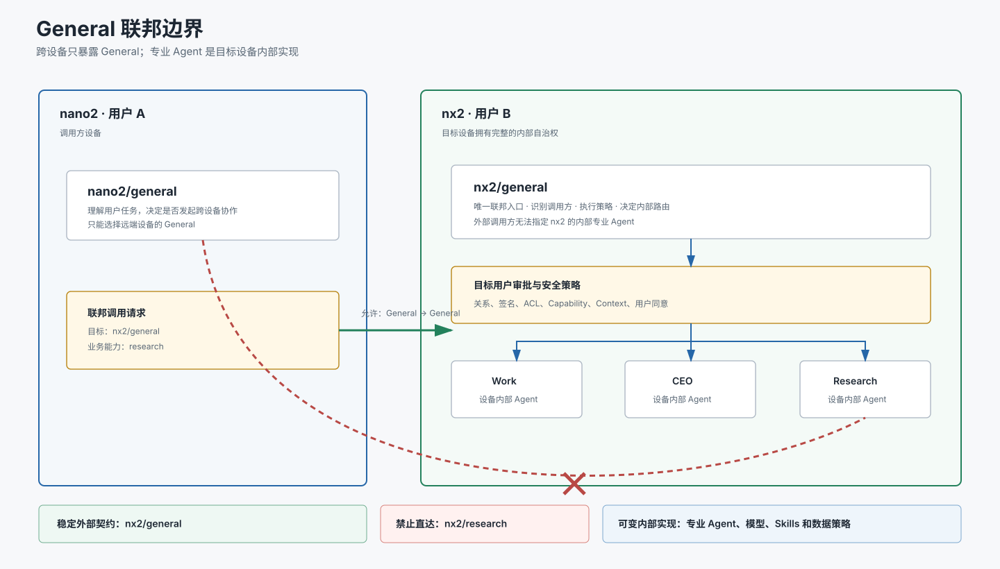
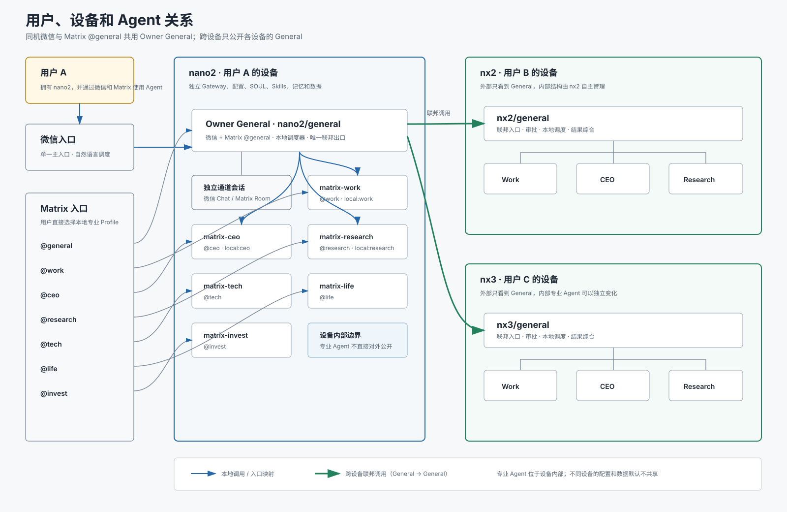

# 二、用户、设备和 Agent

## 1. 文档信息

- 状态：第二板块核心关系和入口边界已确认
- 日期：2026-08-08
- 主题：用户、物理设备、主 Agent、子 Agent 与联邦边界
- 关键决策：同机多入口共用一个 General；跨物理设备只能调用目标设备的 General

## 2. 核心原则

一名用户可以拥有一台或多台物理设备。每台物理设备拥有自己的：

- Hermes Gateway。
- 默认主 Agent，即 General Agent。
- 本地专业子 Agent。
- 独立配置、SOUL、Skills、记忆和数据。
- Federation Node Agent 和设备身份。

设备内部的 General Agent 负责管理和调度该设备上的专业 Agent。

同一物理设备上的微信主入口和 Matrix `@general` 是同一个 General Agent
的两个消息入口，不是两个独立 General。它们共享 Agent 的长期能力和数据，
但各自保留独立聊天会话。

跨设备调用必须遵循以下边界：



调用方不能直接指定或调用另一个物理设备内部的 Research、Work、CEO 等
专业 Agent。

## 3. 目标关系图



联邦层看到的是：

```text
nano2/general
nx2/general
nx3/general
```

联邦层不应直接看到：

```text
nx2/research
nx2/work
nx2/ceo
nx3/research
nx3/work
nx3/ceo
```

这些专业 Agent 属于对应设备的内部实现。

## 4. 用户、设备和 Agent 的所属关系

```text
用户
└─ 拥有一台或多台设备
   └─ 每台设备拥有一个 General Agent
      └─ General Agent 管理多个本地专业 Agent
```

示例：

```text
用户 A
└─ nano2
   ├─ General
   ├─ Work
   ├─ CEO
   └─ Research

用户 B
└─ nx2
   ├─ General
   ├─ Work
   ├─ CEO
   └─ Research

用户 C
└─ nx3
   ├─ General
   ├─ Work
   ├─ CEO
   └─ Research
```

同名 Agent 不表示它们是同一个 Agent。例如：

```text
用户 A 的 Research != 用户 B 的 Research
```

它们可以拥有不同的：

- SOUL。
- Skills。
- 模型与 MoA 配置。
- 私有文件。
- 记忆。
- 工具权限。
- 历史会话。
- 用户调教结果。

## 5. General Agent 的职责

每台设备的 General Agent 是该设备唯一的联邦入口，同时也是本地调度器。

General Agent 负责：

1. 理解外部请求。
2. 判断请求是否允许执行。
3. 判断是否需要目标用户审批。
4. 判断应该由自己处理还是交给本机专业 Agent。
5. 选择一个或多个本机专业 Agent。
6. 对专业 Agent 的结果进行综合。
7. 对外只返回经过本机 General 处理后的结果。
8. 保持该设备用户的数据、能力和内部结构边界。

调用方只能表达业务需求和所需能力，不能控制目标设备内部的具体调度。

正确示例：

```text
nano2/general:
请 nx2/general 研究这个方案的成本与风险。
```

错误示例：

```text
nano2/general:
跳过 nx2/general，直接调用 nx2/research。
```

## 6. 为什么跨设备只公开 General

### 6.1 保持设备自治

目标设备的所有者可以独立调整内部 Agent，而不会破坏其他设备的配置。

例如，nx2 可以把 Research：

- 改名。
- 替换模型。
- 拆分成多个 Agent。
- 暂时停用。
- 改成 MoA。

只要 `nx2/general` 的联邦接口保持稳定，nano2 不需要知道这些变化。

### 6.2 避免外部耦合内部结构

如果 nano2 直接配置 `nx2/research`，那么 nx2 的内部 Agent 名称、能力和
路由会成为 nano2 的外部依赖。

采用 General 边界后：

```text
外部依赖：nx2/general
内部实现：由 nx2 自己管理
```

### 6.3 保持用户控制权

外部用户不能选择性绕过目标用户的主 Agent、策略、审批和安全判断。

所有跨用户请求统一进入目标用户的 General Agent，由目标用户的设备决定：

- 是否接受。
- 是否审批。
- 使用哪个内部 Agent。
- 可以访问哪些数据。
- 返回哪些结果。

### 6.4 简化关系数量

直接公开所有专业 Agent 时，关系数量会快速增长：

```text
设备数 × 每台专业 Agent 数 × 调用方向
```

只公开 General 后，设备间关系保持为：

```text
设备数 × 调用方向
```

专业 Agent 的增删不会导致联邦关系图持续膨胀。

### 6.5 简化后台可视化

第一板块的 Federation Console 只需管理设备 General 之间的 A2A 关系：

```text
nano2/general ──> nx2/general
nano2/general ──> nx3/general
nx2/general   ──> nano2/general
```

点击某台设备后，可以展开查看其内部专业 Agent，但这些内部连线不是联邦
关系，也不能由其他设备直接创建调用边。

## 7. 微信入口

每台设备原则上只有一个面向该设备用户的微信主入口：

```text
微信用户 -> 设备 Gateway -> Owner General Agent
```

微信用户不需要记忆专业 Agent 名称。General Agent 根据自然语言自主选择
本机专业 Agent。

以 nano2 为例：

```text
用户 A 微信
    │
    ▼
nano2/general
    ├─ 工作和执行问题 -> local:work
    ├─ 战略和决策问题 -> local:ceo
    └─ 研究和验证问题 -> local:research
```

当请求需要另一名用户或另一台设备协作时：

```text
nano2/general -> nx2/general
```

然后由 `nx2/general` 自主完成 nx2 内部调度。

## 8. Matrix 入口

Matrix 允许用户直接访问本用户设备上的 General 和多个专业 Profile。

```text
@general  -> Owner General（与微信主入口相同）
@work     -> matrix-work
@ceo      -> matrix-ceo
@research -> matrix-research
@tech     -> matrix-tech
@life     -> matrix-life
@invest   -> matrix-invest
```

Matrix 专业账号和 General 的本地调度可以指向同一个专业 Profile：

```text
微信主 Agent 调用 local:work = Matrix 的 matrix-work Profile
微信主 Agent 调用 local:ceo = Matrix 的 matrix-ceo Profile
微信主 Agent 调用 local:research = Matrix 的 matrix-research Profile
```

因此，同一个专业 Profile 有两种本地使用方法：

1. 微信主 Agent 在后台自主调用。
2. 本用户通过 Matrix 对应账号直接提问。

`@general` 不再拥有独立的长期数据 Profile。Matrix 的 Room、Thread、
仅在被提及时响应、附件发送等规则属于 Matrix 通道，不写入共享 General
的 SOUL。

Matrix 直连权限属于 Agent 所在设备的用户体系，不代表专业 Agent 自动成为
联邦公开 Agent。

## 9. 本地调用与联邦调用的区别

### 9.1 本地调用

```text
nano2/general -> nano2/matrix-research
```

特点：

- 在同一物理设备和用户边界内。
- 可以直接指定本机专业 Agent。
- 使用目标 Profile 的 SOUL、Skills、记忆和数据。
- 不需要跨用户联邦关系。
- 不需要另一台设备用户审批。

### 9.2 联邦调用

```text
nano2/general -> nx2/general
```

特点：

- 跨物理设备或跨用户边界。
- 只能指定目标设备的 General Agent。
- 必须存在有方向的 A2A 关系。
- 必须通过设备身份、签名、ACL 和能力验证。
- 根据策略要求目标用户审批。
- 由目标 General 决定内部专业 Agent。

## 10. Agent 身份模型

Agent 的完整身份不能只使用 `general`、`research` 等名称。

建议逻辑身份：

```text
用户 ID + 设备 ID + Agent 类型或 Profile ID
```

示例：

```text
user-a / nano2 / general
user-a / nano2 / research
user-b / nx2 / general
user-b / nx2 / research
```

联邦公开身份只使用：

```text
user-a / nano2 / general
user-b / nx2 / general
user-c / nx3 / general
```

内部专业 Agent 身份仍然存在，但只在本机 Gateway 和本机管理后台中使用。

不同物理设备上的 General 也不是共享实例：

```text
user-a / nano2 / general != user-b / nx2 / general
```

它们默认不共享 SOUL、Skills、记忆、会话、文件、模型配置或用户资料。
联邦调用只交换经过授权的任务输入和结果。

## 11. 当前实现偏差

截至 2026-08-08，当前部署仍存在以下偏差：

```text
nano2 配置了 federation:nx2-research
nx2 公开了独立的 research export
路由地址为 /research
```

这意味着当前代码和配置允许：

```text
nano2/default -> nx2/research
```

该行为与本板块确认的目标架构不一致。

后续实施时应迁移为：

```text
nano2/general -> nx2/general
nx2/general -> nx2 内部 Research
```

迁移要求：

1. 停止把 `nx2/research` 暴露为外部联邦候选。
2. nano2 删除 `federation:nx2-research` 路由配置。
3. nx2 的 Research 保留为 nx2 内部专业 Agent。
4. 为 nx2/general 配置本地专业 Agent 编排能力。
5. 归档已有远程 Research 的 Context、路由、关系和操作元数据。
6. Control Plane 删除或撤销直达 Research 的关系。
7. Federation Console 不再允许创建指向远端专业 Agent 的关系。

已确认采用“归档后统一清理”：核对没有活动请求、操作或 Grant 后，删除旧
运行入口，不将 `nx2/research` 继续迁移为新的长期调用路径。所有后续调用
统一进入 `nx2/general`。

本节只记录目标要求和当前偏差，不在本次文档编写中直接修改线上配置。

## 12. 跨设备配置复用

设备间默认不自动共享 Agent 配置。未来需要复用 Skills、Agent 定义或 SOUL
时，由 Federation Console 提供版本化发布和显式导入：

```text
源设备发布不可变版本
        ↓
目标设备确认导入
        ↓
导入后在目标设备独立演化
```

发布内容只能包含管理员明确选择的 Skills、Agent 定义和 SOUL，不得包含：

- 会话和长期记忆。
- 用户文件和用户画像。
- `.env`、Token、私钥或其他凭据。
- Grant、Context、审批记录和审计正文。

V1 只在后台和数据模型中预留该能力，不提供发布、导入或自动同步操作。

## 13. 后台管理界面的展示要求

Federation Console 的默认拓扑只展示 General 之间的联邦关系：

参见上方 [General 联邦边界](assets/二-General联邦边界.svg)。后台默认只把
General 之间的连线表示为跨设备联邦关系；专业 Agent 显示为设备内部节点。

显示规则：

- General 之间使用实线和箭头表示联邦关系。
- General 与本机专业 Agent 使用设备内部连线。
- 外部用户不能从拓扑图创建到专业 Agent 的联邦关系。
- 点击设备可以展开内部 Agent。
- 内部 Agent 只显示能力和健康，不显示为跨设备公开端点。
- 如果检测到历史直达专业 Agent 的关系，后台应标记为架构偏差。

## 14. 验收标准

1. 一名用户可以拥有一台或多台物理设备。
2. 每台设备拥有一个 General Agent 和零个或多个本地专业 Agent。
3. 微信默认进入设备的 General Agent。
4. General Agent 可以自主调用本机专业 Agent。
5. Matrix 可以直接访问本用户设备上的专业 Profile。
6. 跨设备调用只能选择目标设备的 General Agent。
7. 外部调用方不能发现或直接调用远端专业 Agent。
8. 远端 General 可以根据请求自主调用自己的专业 Agent。
9. 目标用户的审批、数据和安全策略不能被外部调用方绕过。
10. Federation Console 不能创建指向远端专业 Agent 的关系。
11. 同名 Agent 在不同用户和设备上保持独立身份、配置和数据。
12. 当前 `nx2/research` 直达配置被明确识别为待迁移偏差。
13. 微信与 Matrix `@general` 在同一设备上指向同一个 Owner General。
14. 不同设备之间不会自动同步 Agent 配置或数据。

## 15. 已确认要求

- 物理设备拥有自己的 Hermes Gateway。
- 每台设备拥有自己的 General 主 Agent。
- 每台设备可以拥有多个本地专业子 Agent。
- 微信使用一个 General 主入口，由其自主分配本机专业 Agent。
- Matrix `@general` 与微信主入口使用同一个 Owner General。
- Matrix 可以让本用户直接访问指定的本地专业 Profile。
- 跨物理设备只允许调用目标设备的 General Agent。
- 远端专业 Agent 由远端 General 内部调度，不对外直接公开。
- 当前 `nx2/research` 直达能力按“归档后统一清理”迁移。
- 跨设备配置复用采用版本化发布和显式导入，V1 只预留。
