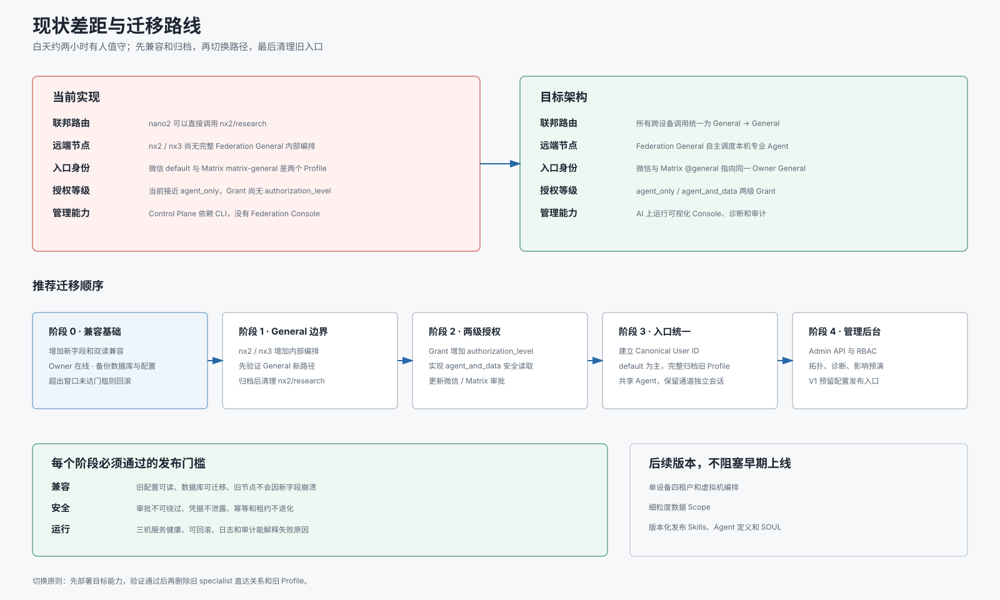

# 五、现状差距与迁移路线

## 1. 文档信息

- 状态：迁移顺序、维护窗口和旧数据处理方式已确认
- 日期：2026-08-08
- 主题：当前部署到目标架构的兼容迁移
- 核心原则：先增加新能力，再切换流量，最后删除旧路径
- 维护窗口：首次正式架构迁移安排在白天有人值守的约两小时窗口

## 2. 迁移总览

## 3. 当前已经具备

- nano2、nx2、nx3 各自运行 Hermes Gateway 和 Federation Node Agent。
- AI 服务器运行 Federation Control Plane。
- 节点证书、Manifest、关系同步和任务签名已经可用。
- 具备目标用户审批、拒绝、Grant 和有效期。
- 具备加密 Operation、幂等、持久化队列、租约和崩溃恢复。
- nano2 具备本地 Work、CEO、Research 编排。
- 微信和 Matrix 专业账号可以使用本地 Profile。
- 插件保持独立，没有修改 Hermes Agent 核心。

## 4. 当前与目标的主要差距

| 领域 | 当前实现 | 目标架构 |
|---|---|---|
| 联邦入口 | 可以直接调用 `nx2/research` | 只能 General → General |
| 远端编排 | nx2、nx3 主要执行固定 Guest Export | Federation General 自主调度本机 Agent |
| 授权等级 | 接近 `agent_only` | `agent_only` 与 `agent_and_data` |
| General 入口 | 微信 `default` 与 Matrix `matrix-general` 分离 | 两个入口指向同一 Owner General |
| 用户身份 | 主要依赖平台用户 ID | Canonical User ID 关联所有入口 |
| 管理方式 | Control Plane CLI | Federation Console、Admin API 和审计 |
| 多租户 | 当前按物理设备单用户 | 后续支持单设备最多四租户 |

## 5. 实施优先级

### P0：兼容和安全基础

必须最先完成：

- 为数据库和协议增加新字段时保持旧配置可读。
- 新字段采用安全默认值。
- Grant 增加 `authorization_level`，旧 Grant 迁移为 `agent_only`。
- 数据库迁移支持并发进程启动。
- 建立部署前备份、迁移快照测试和一键回滚路径。
- 保持 Hermes 核心零修改。

### P1：General 到 General

- nx2、nx3 增加 Federation General 内部编排。
- 新调用只发现远端 General。
- 目标 General 根据 Capability 调用本机专业 Agent。
- 外部请求不能指定内部 Agent。
- 新路径验证稳定前保留旧 `nx2/research` 作为回滚路径，但停止新增会话。
- 完成会话迁移后撤销 Control Plane specialist 关系并删除旧路由。

### P1：两级授权

- 审批请求增加 `authorization_level`。
- 支持 `agent_only` 和 `agent_and_data`。
- 旧审批行为映射为 `agent_only`。
- `agent_and_data` 只能读取目标 Agent 自己的数据。
- `.env`、`auth.json`、Token、私钥和其他 Profile 始终拒绝。
- 微信和 Matrix 使用口语化审批表达。
- Federation Console 显示每个 Grant 的授权等级。

### P1：Owner General 入口统一

- 建立 Canonical User ID 和入口身份映射。
- 确定 nano2 Owner General 的稳定 `agent_id`。
- 微信主入口与 Matrix `@general` 指向同一 Agent。
- 共享 SOUL、Skills、长期记忆和用户资料。
- 微信 Chat 与 Matrix Room/Thread 保持独立会话。
- 以 `default` 为主 Profile，禁止数据库直接覆盖。
- Matrix 通道专属规则留在 Gateway 配置。
- 迁移完成后归档旧 `matrix-general` Profile。

### P2：Federation Console

- 在 AI 服务器增加 Admin API 和 Web UI。
- 实现用户、设备、Agent、关系和授权等级拓扑。
- 实现“为什么不能调用”的逐层诊断。
- 实现关系变更影响预演和受控写操作。
- 实现分级多用户 RBAC。
- 实现敏感正文按需读取、二次验证和不可删除审计。
- 预留 Skills、Agent 定义和 SOUL 的版本化发布/导入入口。
- V1 不提供实际配置分发或实时同步。

## 6. 推荐实施阶段

### 阶段 0：冻结和备份

- 在白天安排约两小时维护窗口，设备 Owner 全程在线。
- 维护窗口内由 Owner 完成必要扫码、审批和人工对话验证。
- 记录三台设备当前版本、配置摘要和服务状态。
- 备份配置、数据库、密钥路径和 systemd 单元。
- 清理测试产生的临时 Grant、Receipt 和路由绑定。
- 定义每个阶段的回滚提交和回滚配置。

### 阶段 1：部署兼容代码

- 只增加数据库字段和兼容读取。
- 不切换现有业务路径。
- 在三台设备执行生产数据库快照迁移测试。
- 验证旧调用仍然工作。

### 阶段 2：启用远端 General 编排

- 先在 nx2 建立 Federation General 和内部专业 Agent 调度。
- nano2 增加 `nx2/general` 新路由测试。
- 验证审批、租约、幂等、恢复和结果综合。
- 再将相同能力部署到 nx3。

### 阶段 3：切断 specialist 直达

- 停止创建新的 `nx2/research` 会话。
- 归档旧 Context、路由、关系和操作元数据。
- 核对无活动请求、操作和 Grant 后统一清理旧入口。
- 删除 nano2 的远端 specialist 候选。
- 撤销 Control Plane 直达 specialist 关系。
- 保留旧配置备份，但不再提供运行入口。

### 阶段 4：启用两级授权

- 现有 Grant 全部迁移为 `agent_only`。
- 更新审批消息和命令。
- 先验证 `agent_only` 与现有行为一致。
- 单独验证 `agent_and_data` 的读取边界和硬拒绝项。

### 阶段 5：合并 General 入口

- 建立微信、Matrix 和后台身份到 Canonical User 的映射。
- 以 `default` 为主 Profile，保留其数据库、会话、记忆和用户数据。
- 全量盘点 `matrix-general`，为每个文件记录合并、保留或归档去向。
- 合并通用人格、Skills 和调度能力，不直接覆盖同名运行文件。
- 将 Matrix 专属响应、Room 和附件规则留在 Matrix Gateway。
- 将 Matrix `@general` 切换到 Owner General。
- 检查微信和 Matrix 会话互不串线。
- 验证通过后将旧 `matrix-general` 转为只读归档。

### 阶段 6：上线 Federation Console

- Console 首先以只读方式接入。
- 验证拓扑、健康、诊断和审计。
- 再启用关系创建、撤销等受控写操作。
- 最后启用超级管理员按需查看任务正文。
- 展示跨设备配置发布的预留位置，但 V1 不开放操作。

## 7. 每阶段发布门槛

每个阶段都必须满足：

### 兼容性

- 旧配置和旧数据库可以读取。
- 新旧节点短时间混合运行不会破坏数据。
- 系统提示明确，不出现无限重启。

### 安全

- 审批、关系、ACL 和签名不能被绕过。
- 凭据、密钥和其他 Profile 数据不能泄露。
- `agent_and_data` 不等于设备文件系统权限。

### 可靠性

- 同一操作不会重复执行。
- 执行租约丢失后不能提交结果。
- Gateway 重启后能够恢复任务。
- Pending 请求不能通过故障切换绕过审批。

### 运维

- nano2、nx2、nx3 服务健康。
- Agent Card 和 Node Agent 状态正常。
- 有明确备份、回滚命令和部署记录。
- 日志和审计可以解释失败原因。

## 8. 不阻塞早期版本的事项

以下事项推迟到后续版本：

- 单设备四租户的完整虚拟机或容器编排。
- 逐文件、逐数据集的细粒度数据 Scope。
- Control Plane 多副本高可用。
- 完全去中心化关系治理。
- 自动跨区域灾备。
- 复杂计费、配额和资源调度。
- Skills、Agent 定义和 SOUL 的实际跨设备发布、导入和更新。

早期版本只保证：

- 物理设备单用户。
- General 到 General。
- 两级授权。
- 稳定幂等和恢复。
- 基础管理后台。

## 9. 已确认的迁移决策

### 9.1 维护窗口

- 首次正式架构迁移使用白天有人值守的约两小时窗口。
- 设备 Owner 保持在线，负责扫码、审批和最终人工验证。
- 超出窗口仍未达到发布门槛时回滚，不在无人值守状态下继续切换。

### 9.2 旧 `nx2/research`

- 采用“归档后统一清理”。
- 归档 Context、路由、关系、Grant 和操作元数据。
- 当前无活动 Research 请求、操作和 Grant，因此不等待旧任务继续运行。
- 清理后只允许通过 `nx2/general` 发起新调用。

### 9.3 Owner General Profile

- 采用完整 Profile 迁移，以 `default` 为主 Profile。
- 完整迁移强调不丢文件和可追溯，不使用空数据库覆盖现有数据。
- `matrix-general` 的通用能力进入 Owner General；Matrix 专属规则留在
  Matrix Gateway。
- 冲突文件保留主 Profile 的运行版本，旧版本进入只读归档。

### 9.4 跨设备配置复用

- 未来采用版本化发布和显式导入，不采用持续双向同步。
- 发布范围只允许 Skills、Agent 定义和 SOUL。
- 会话、记忆、用户文件、凭据、Grant 和审批数据不进入发布包。
- V1 只预留后台入口和设计，不实现实际发布或导入。

## 10. 验收标准

1. 三台设备只向联邦公开 General。
2. nx2、nx3 General 可以自主调用本机专业 Agent。
3. 旧 specialist 直达关系和路由被安全移除。
4. 所有 Grant 明确包含授权等级。
5. 旧 Grant 安全迁移为 `agent_only`。
6. 微信与 Matrix `@general` 指向同一 Owner General。
7. 微信和 Matrix 会话保持独立。
8. Federation Console 可以解释当前拓扑、状态和失败原因。
9. 任一阶段失败时可以恢复到上一个稳定版本。
10. Hermes Agent 核心保持无联邦特例修改。
11. `default` 的数据库、会话和记忆在 Profile 合并后保持完整。
12. Matrix 通道规则不会改变微信入口行为。
13. 不同设备的 General 不会自动共享配置和数据。
