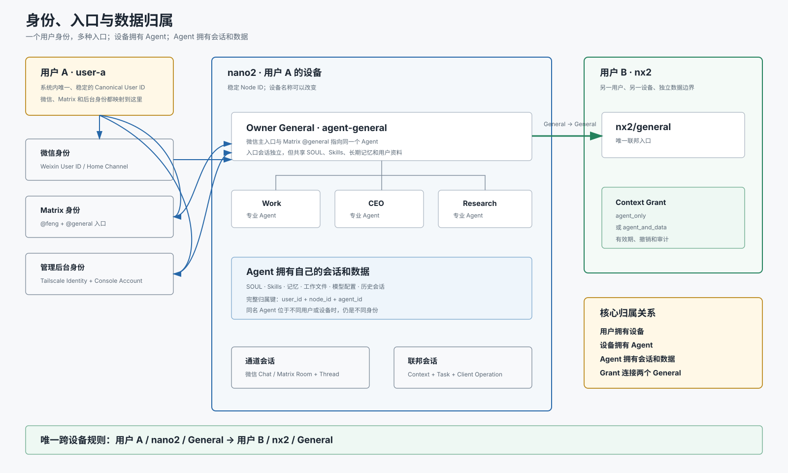

# 四、身份与数据归属

## 1. 文档信息

- 状态：第四章核心要求已确认
- 日期：2026-08-08
- 主题：用户、设备、Agent、入口、会话、授权和数据归属
- 核心原则：一个用户身份，多种入口；设备拥有 Agent；Agent 拥有数据

## 2. 一句话模型

```text
用户
└─ 设备
   └─ Agent
      └─ 会话和数据
```

微信、Matrix 和管理后台只是入口，不是新的用户或新的 Agent。

## 3. 总体关系



## 4. 用户身份

一个真实用户在系统中只有一个稳定的 Canonical User ID：

```text
user-a
├─ 微信身份
├─ Matrix 身份
└─ 管理后台身份
```

不同入口身份都映射到同一个用户，用于判断：

- 哪些设备属于该用户。
- 用户可以访问哪些 Agent 和数据。
- 微信审批人与 Matrix 审批人是否是同一用户。
- 一次调用是同用户多设备调用还是跨用户调用。

平台用户 ID 可以变化或重新绑定，但 Canonical User ID 不变。

## 5. 设备身份

设备属于用户：

```text
用户 A
├─ nano2
├─ edge
└─ spark
```

每台设备使用不可变 `node_id`。设备名称可以修改，但不能因此生成新设备身份。

设备身份至少包括：

| 字段 | 作用 |
|---|---|
| `owner_id` | 设备所属用户 |
| `node_id` | 不可变设备身份 |
| `node_name` | 可修改显示名称 |
| `transport_id` | A2A 传输名称 |
| 公钥和证书 | 设备认证 |
| Manifest generation | 设备配置版本 |
| 最后心跳 | 在线状态 |

## 6. Agent 身份

Agent 属于用户和设备，完整身份为：

```text
owner_id + node_id + agent_id
```

示例：

```text
user-a / nano2 / general
user-a / nano2 / research
user-b / nx2 / general
```

Agent 字段需要区分：

| 字段 | 规则 |
|---|---|
| `agent_id` | 不可变身份 |
| `slug` | 配置与内部路由名称 |
| `display_name` | 可修改界面名称 |
| `profile_id` | 实际 Hermes Profile |

同名 Agent 如果属于不同用户或设备，就是不同 Agent。

## 7. 微信与 Matrix 入口

目标架构中，微信主入口和 Matrix `@general` 指向同一个 Owner General：

```text
微信主入口 ─────┐
                ├─> nano2 Owner General
Matrix @general ┘
```

它们共享：

- General Agent 身份。
- SOUL。
- Skills。
- 长期记忆。
- 用户资料。
- 本地专业 Agent 调度能力。

它们不共享当前聊天会话：

- 微信消息保留微信 Chat 会话。
- Matrix 消息保留 Room 和 Thread 会话。
- 入口切换不会把两个聊天窗口强行合并。

Matrix 专业账号继续指向独立专业 Agent：

```text
@work     -> Work
@ceo      -> CEO
@research -> Research
@tech     -> Tech
@life     -> Life
@invest   -> Invest
```

## 8. 当前实现偏差

当前实际配置为：

```text
微信主入口 -> default Profile
Matrix @general -> matrix-general Profile
```

它们拥有独立 `state.db`、会话、记忆和配置，目前不是同一个 General Agent。

后续迁移要求：

1. 确定 nano2 Owner General 的唯一 `agent_id`。
2. 微信主入口和 Matrix `@general` 都映射到该 Agent。
3. 合并或迁移需要保留的 SOUL、Skills 和长期记忆。
4. 保持微信 Chat 与 Matrix Room/Thread 会话独立。
5. 旧 `matrix-general` Profile 只在迁移完成后归档。

## 9. 会话层级

系统保留四层会话：

| 会话 | 作用 |
|---|---|
| 消息会话 | 确定微信 Chat 或 Matrix Room/Thread |
| Owner General 会话 | 保持主 Agent 的当前对话 |
| 编排会话 | 保持对本地或远端 Agent 的稳定路由 |
| 联邦会话 | 支持审批、幂等、恢复和跨设备查询 |

主要关联字段：

```text
消息入口：platform + account + chat_id + thread_id
编排路由：parent_session + conversation + capability
联邦操作：context_id + task_id + client_operation_id
```

## 10. 数据归属

数据按以下层级归属：

```text
用户数据
└─ 设备数据
   └─ Agent 数据
      └─ 会话数据
```

Agent 数据包括：

- SOUL。
- Skills。
- 长期记忆。
- 历史会话。
- 工作文件。
- 用户画像。
- 模型和工具配置。

完整归属键为：

```text
user_id + node_id + agent_id
```

删除设备不能误删用户其他设备的数据。删除 Agent 前必须处理活动会话、
Grant、Operation、路由绑定和归档。

## 11. 跨设备授权

跨设备只允许：

```text
source General -> target General
```

Grant 至少绑定：

- 调用用户、设备和 General。
- 目标用户、设备和 General。
- Capability。
- Context。
- 授权等级。
- 创建时间、有效期和撤销状态。

早期版本授权等级固定为：

```text
agent_only
agent_and_data
```

`agent_only` 只允许目标 Agent 执行任务。

`agent_and_data` 允许目标 Agent 执行任务并读取该 Agent 自己的数据，但不能
读取凭据、私钥、其他用户或其他 Agent 的数据。

## 12. 同用户与跨用户调用

同一个 `owner_id` 的设备属于同一用户；不同 `owner_id` 表示跨用户。

无论是否同一用户，跨设备调用都必须：

- 使用设备签名。
- 存在有方向关系。
- 记录 Context 和授权等级。
- 产生审计记录。

跨用户调用必须由目标用户审批。同用户多设备是否自动审批，可以作为后续
策略配置，不改变身份模型。

## 13. 验收标准

1. 一个真实用户只有一个 Canonical User ID。
2. 微信、Matrix 和后台身份可以映射到同一用户。
3. 每台设备拥有稳定 `node_id`。
4. 每个 Agent 拥有稳定 `agent_id`。
5. 微信主入口和 Matrix `@general` 指向同一个 Owner General。
6. 不同入口共享 Agent 长期能力，但保持聊天会话独立。
7. 同名 Agent 在不同用户或设备上不会发生身份冲突。
8. Agent 数据可以追溯到唯一用户、设备和 Agent。
9. 跨设备 Grant 精确绑定两个 General、Context 和授权等级。
10. 删除用户、设备或 Agent 时不会误删其他归属的数据。
11. Federation Console 可以按照用户、设备和 Agent 展示完整归属关系。

## 14. 已确认要求

- 一个用户可以拥有多台设备。
- 一台设备可以拥有一个 General 和多个专业 Agent。
- 微信和 Matrix 是入口，不单独产生新的用户身份。
- 微信主入口与 Matrix `@general` 合并到同一个 Owner General。
- 不同入口保持各自聊天会话。
- Agent 拥有自己的 SOUL、Skills、记忆、文件和会话。
- 跨设备只能 General 调用 General。
- Grant 使用 `agent_only` 或 `agent_and_data`。
